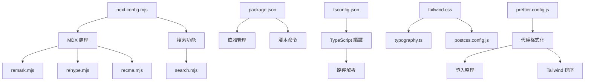

# AMIGO 幫助中心項目結構分析

## 項目概述

**項目名稱**: AMIGO-HELPCENTER  
**技術架構**: Next.js 15 + React 19 + TypeScript + Tailwind CSS v4  
**部署目標**: GitHub Pages 靜態網站  
**主要用途**: AMIGO 自動販賣機後台系統操作手冊展示平台  

## 技術棧詳細分析

### 核心框架
- **Next.js 15**: 使用 App Router 架構，支援 MDX 頁面
- **React 19**: 最新版本，支援並發特性
- **TypeScript 5.8.3**: 強型別支援，提升代碼品質

### 樣式系統
- **Tailwind CSS v4**: 最新版本，使用 CSS 變數和現代語法
- **@tailwindcss/typography**: 提供優雅的文字排版
- **Framer Motion**: 動畫和過渡效果

### 內容管理
- **MDX**: 支援在 Markdown 中使用 React 組件
- **Remark/Rehype**: MDX 處理插件生態
- **FlexSearch**: 全文搜索功能

### UI 組件庫
- **Headless UI**: 無樣式的可訪問性組件
- **React Highlight Words**: 搜索結果高亮

## 目錄結構分析

```
amigo-helpcenter/
├── src/                          # 源代碼目錄
│   ├── app/                      # Next.js App Router 頁面
│   │   ├── layout.tsx           # 根佈局組件
│   │   ├── page.mdx             # 首頁內容
│   │   ├── providers.tsx        # 全局狀態提供者
│   │   ├── attachments/         # 附件相關頁面
│   │   ├── authentication/     # 認證相關頁面
│   │   ├── contacts/           # 聯繫人相關頁面
│   │   ├── conversations/      # 對話相關頁面
│   │   ├── errors/             # 錯誤處理頁面
│   │   ├── groups/             # 群組相關頁面
│   │   ├── messages/           # 消息相關頁面
│   │   ├── pagination/         # 分頁相關頁面
│   │   ├── quickstart/         # 快速開始頁面
│   │   ├── sdks/               # SDK 相關頁面
│   │   └── webhooks/           # Webhook 相關頁面
│   ├── components/              # React 組件
│   │   ├── Layout.tsx          # 主佈局組件
│   │   ├── Header.tsx          # 頁面頭部
│   │   ├── Navigation.tsx      # 導航組件
│   │   ├── Footer.tsx          # 頁面底部
│   │   ├── Search.tsx          # 搜索功能
│   │   ├── Button.tsx          # 按鈕組件
│   │   ├── Code.tsx            # 代碼展示組件
│   │   ├── Prose.tsx           # 文字內容組件
│   │   ├── ThemeToggle.tsx     # 主題切換
│   │   ├── MobileNavigation.tsx # 移動端導航
│   │   └── mdx.tsx             # MDX 組件映射
│   ├── lib/                     # 工具函數
│   │   └── remToPx.ts          # 單位轉換工具
│   ├── mdx/                     # MDX 處理邏輯
│   │   ├── search.mjs          # 搜索索引構建
│   │   ├── remark.mjs          # Remark 插件配置
│   │   ├── rehype.mjs          # Rehype 插件配置
│   │   └── recma.mjs           # Recma 插件配置
│   └── styles/                  # 樣式文件
│       └── tailwind.css        # Tailwind CSS 配置
├── docs/                        # 文檔目錄
│   └── usermanual/             # 使用者手冊
│       └── AMIGO 自動販賣機後台系統操作手冊（加盟主版V2508021110）.md
├── 配置文件
│   ├── next.config.mjs         # Next.js 配置
│   ├── package.json            # 項目依賴和腳本
│   ├── tsconfig.json           # TypeScript 配置
│   ├── postcss.config.js       # PostCSS 配置
│   ├── prettier.config.js      # Prettier 配置
│   └── typography.ts           # 字體排版配置
└── 其他文件
    ├── README.md               # 項目說明
    ├── CHANGELOG.md            # 變更日誌
    └── LICENSE.md              # 授權條款
```

## 核心組件分析

### 佈局組件 (Layout Components)

#### Layout.tsx
- **功能**: 主佈局組件，管理整體頁面結構
- **特點**: 響應式設計，左側導航 + 主內容區域
- **依賴**: SectionProvider, Header, Navigation, Footer

#### Header.tsx
- **功能**: 頁面頭部，包含搜索、導航、主題切換
- **特點**: 滾動時背景透明度變化，支援移動端
- **組件**: Search, MobileNavigation, ThemeToggle

#### Navigation.tsx
- **功能**: 左側導航欄，支援多層級導航
- **特點**: 動畫過渡，當前頁面高亮，章節導航
- **數據**: 從 navigation 配置動態生成

#### Footer.tsx
- **功能**: 頁面底部，包含頁面導航和社交連結
- **特點**: 自動生成上一頁/下一頁導航

### 功能組件 (Functional Components)

#### Search.tsx
- **功能**: 全文搜索功能，支援 ⌘K 快捷鍵
- **技術**: Algolia Autocomplete + FlexSearch
- **特點**: 即時搜索，結果高亮，鍵盤導航

#### Button.tsx
- **功能**: 統一的按鈕組件
- **變體**: primary, secondary, filled, outline, text
- **特點**: 支援圖標、載入狀態、不同尺寸

#### Code.tsx
- **功能**: 代碼展示組件
- **特點**: 語法高亮 (Shiki)，代碼組 (CodeGroup)
- **支援**: 多種程式語言，複製功能

### MDX 處理系統

#### search.mjs
- **功能**: 構建搜索索引，提取頁面內容
- **技術**: FlexSearch Document 索引
- **特點**: 自動掃描 MDX 文件，提取標題和內容

#### remark.mjs / rehype.mjs / recma.mjs
- **功能**: MDX 內容處理插件
- **作用**: 語法擴展、代碼高亮、註解處理

## 當前內容結構

### 現有頁面
基於 Protocol API 文檔模板，包含：
- API 文檔相關頁面 (attachments, authentication, contacts 等)
- 快速開始指南 (quickstart)
- SDK 文檔 (sdks)
- Webhook 文檔 (webhooks)

### AMIGO 操作手冊
位於 `docs/usermanual/` 目錄，包含：
- 系統登入與介面導覽
- 核心功能模塊詳解 (設備管理、商品管理、財務報表)
- 常見問題與技術支援

## 技術特點

### 響應式設計
- 移動端優先設計
- 斷點: sm(640px), md(768px), lg(1024px), xl(1280px)
- 左側導航在大螢幕固定，小螢幕收合

### 主題系統
- 支援明暗主題切換
- CSS 變數驅動的顏色系統
- 自動檢測系統偏好

### 搜索功能
- FlexSearch 全文索引
- 支援中文搜索
- 即時搜索結果
- 鍵盤快捷鍵支援

### 性能優化
- Next.js 靜態生成 (SSG)
- 圖片優化 (Sharp)
- 代碼分割和懶加載
- 字體優化

## 配置文件說明

### next.config.mjs
- MDX 支援配置
- 搜索插件整合
- 文件追蹤配置

### package.json
- 項目名稱: "tailwind-plus-protocol" (需更新)
- 腳本: dev, build, start, lint
- 依賴管理: 所有必要的包和版本

### tsconfig.json
- TypeScript 編譯配置
- 路徑別名: @/* -> ./src/*
- 嚴格模式啟用

## 潛在問題識別

1. **項目名稱不一致**: package.json 中仍為 "tailwind-plus-protocol"
2. **缺少 scripts 目錄**: 未遵循標準化腳本管理
3. **內容與實際需求不符**: 當前為 API 文檔模板，需調整為操作手冊展示
4. **缺少 GitHub Pages 配置**: 需要靜態導出配置
5. **缺少日誌系統**: 未配置日誌記錄功能

## 配置文件詳細分析

### 核心配置文件

#### next.config.mjs
```javascript
// Next.js 主配置文件
- MDX 支援: 整合 @next/mdx 處理 .mdx 文件
- 插件系統: remark, rehype, recma 處理管道
- 搜索整合: withSearch 包裝器添加搜索功能
- 頁面擴展: 支援 .js, .jsx, .ts, .tsx, .mdx 文件
- 文件追蹤: 包含所有 MDX 文件用於構建優化
```

#### package.json
```json
// 項目依賴和腳本管理
- 名稱: "tailwind-plus-protocol" (需更新為 AMIGO-HELPCENTER)
- 版本: "0.1.0"
- 腳本: dev, build, start, lint (缺少 export 和 deploy)
- 依賴: 現代化技術棧，版本符合要求
- 瀏覽器支援: "defaults, not ie <= 11"
```

#### tsconfig.json
```json
// TypeScript 編譯配置
- 目標: ES6，支援現代瀏覽器
- 模組系統: ESNext + bundler 解析
- 嚴格模式: 啟用所有嚴格檢查
- 路徑別名: @/* 映射到 ./src/*
- JSX: preserve 模式，由 Next.js 處理
```

### 樣式配置文件

#### src/styles/tailwind.css
```css
// Tailwind CSS v4 配置
- 導入: @import 'tailwindcss'
- 插件: @plugin '@tailwindcss/typography'
- 配置: @config '../../typography.ts'
- 主題: 自定義變體和 CSS 變數
- 代碼高亮: Shiki 主題變數定義
```

#### typography.ts
```typescript
// 字體排版詳細配置 (355行)
- 顏色系統: 明暗主題 CSS 變數
- 文字樣式: 標題、段落、列表、引用
- 表格樣式: 完整的表格排版規則
- 代碼樣式: 行內代碼和代碼塊
- 響應式: 不同螢幕尺寸的適配
```

#### postcss.config.js
```javascript
// PostCSS 處理配置
- 插件: @tailwindcss/postcss (Tailwind CSS v4 處理器)
- 簡潔配置: 僅包含必要的 Tailwind 處理
```

### 開發工具配置

#### prettier.config.js
```javascript
// 代碼格式化配置
- 引號: 單引號 (singleQuote: true)
- 分號: 不使用 (semi: false)
- 插件:
  - prettier-plugin-organize-imports (自動整理導入)
  - prettier-plugin-tailwindcss (Tailwind 類名排序)
- Tailwind 樣式表: 指向 ./src/styles/tailwind.css
```

### MDX 處理配置

#### src/mdx/search.mjs
```javascript
// 搜索索引構建
- FlexSearch Document 配置
- 自動掃描 src/app/**/*.mdx 文件
- 提取標題和內容建立索引
- 支援全文搜索和上下文搜索
```

#### src/mdx/remark.mjs, rehype.mjs, recma.mjs
```javascript
// MDX 內容處理插件
- remark: Markdown 語法處理
- rehype: HTML 轉換處理
- recma: JavaScript 代碼處理
- 支援 GFM、代碼高亮、註解等功能
```

### 配置文件相互關係



## 代碼品質評估

### 文件行數檢查

#### 符合規範的文件
✅ **大部分文件符合行數限制**
- TypeScript 文件大多在 100-300 行範圍內
- 組件文件結構清晰，職責單一
- 配置文件簡潔明瞭

#### 需要關注的文件
⚠️ **超過建議行數的文件**
1. **typography.ts (355行)** - 超過 TypeScript 300行限制
   - 原因: 完整的 Tailwind Typography 配置
   - 建議: 可接受，因為是配置文件且結構清晰

2. **src/components/Search.tsx (494行)** - 超過 TypeScript 300行限制
   - 原因: 包含完整的搜索功能實現
   - 建議: 需要重構，拆分為多個子組件

### 目錄組織檢查

#### 符合規範的目錄
✅ **src/components/ (22個文件 + icons子目錄)**
- 主要組件: 22個文件，接近8個文件的建議上限
- icons子目錄: 24個圖標文件，建議進一步分類

✅ **src/app/ (11個子目錄)**
- 頁面組織清晰，每個功能模塊獨立目錄
- 符合 Next.js App Router 最佳實踐

#### 需要優化的目錄
⚠️ **src/components/icons/ (24個文件)**
- 超過8個文件的建議限制
- 建議: 按功能分類到子目錄 (ui/, navigation/, content/ 等)

### 代碼「壞味道」檢查

#### 發現的問題

1. **冗餘 (Redundancy)**
   - ❌ 項目名稱不一致: package.json 中仍為 "tailwind-plus-protocol"
   - ❌ 重複的導航配置: Header.tsx 和 Navigation.tsx 中有重複的導航項目

2. **晦澀性 (Obscurity)**
   - ❌ 缺少中文註釋: 對於中文團隊，關鍵組件缺少中文說明
   - ❌ 複雜的搜索邏輯: Search.tsx 中的邏輯過於複雜，缺少清晰的註釋

3. **不必要的複雜性 (Needless Complexity)**
   - ❌ 過度設計的動畫: 某些簡單組件使用了複雜的 Framer Motion 動畫
   - ❌ 複雜的 MDX 處理: 對於操作手冊展示，當前的 MDX 處理可能過於複雜

#### 未發現的問題
✅ **沒有發現以下問題**
- 僵化 (Rigidity): 組件設計靈活，易於修改
- 循環依賴: 依賴關係清晰，無循環引用
- 脆弱性: 組件間耦合度低，修改影響範圍可控
- 數據泥團: 沒有發現重複的參數組合

### 技術債務評估

#### 高優先級
1. **Search.tsx 重構** - 拆分為多個子組件
2. **項目名稱統一** - 更新所有配置文件
3. **圖標目錄重組** - 按功能分類圖標文件

#### 中優先級
1. **添加中文註釋** - 提升代碼可讀性
2. **簡化動畫邏輯** - 移除不必要的複雜動畫
3. **優化 MDX 配置** - 簡化處理流程

#### 低優先級
1. **typography.ts 重構** - 可選，當前結構可接受
2. **組件文檔完善** - 添加 JSDoc 註釋

### 代碼品質評分

| 項目 | 評分 | 說明 |
|------|------|------|
| **文件組織** | 8/10 | 大部分符合規範，少數文件需要重構 |
| **代碼結構** | 7/10 | 整體清晰，但存在複雜組件 |
| **命名規範** | 9/10 | 命名清晰一致，符合 React 慣例 |
| **依賴管理** | 9/10 | 依賴版本新穎，無安全問題 |
| **類型安全** | 9/10 | TypeScript 配置嚴格，類型覆蓋完整 |
| **整體品質** | 8.2/10 | 高品質代碼庫，需要少量重構 |

## 優化建議

1. **重構內容結構**: 基於 AMIGO 操作手冊重新組織導航和頁面
2. **添加 scripts 目錄**: 標準化開發和部署腳本
3. **配置 GitHub Pages**: 添加靜態導出和部署配置
4. **品牌統一**: 更新所有項目名稱和元數據
5. **中文化優化**: 調整界面語言和內容展示方式
6. **代碼重構**: 拆分 Search.tsx，重組 icons 目錄
7. **技術債務清理**: 簡化不必要的複雜性，添加中文註釋
