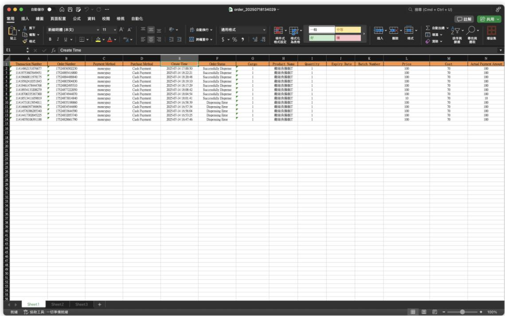

# AMIGO 自動販賣機後台系統操作手冊

（加盟主版 V2508021110）

# 版本控制

<table><tr><td>版本號</td><td>修改日期</td><td>修改人</td><td>變更摘要</td></tr><tr><td>V2508021110</td><td>2025年8月2日</td><td>AMIGO</td><td>內容優化</td></tr><tr><td>V2507281600</td><td>2025年7月28日</td><td>AMIGO</td><td>手冊初始化提交</td></tr></table>

# 總

您在接收本系統所附之硬體與軟體服務時，即視為已閱讀。理解並同意遵守本手冊所載之所有條款。下述條款構成您與我方之間合作關係的核心依據，對雙方均具有約束力。

本手冊內容係依據標準系統功能與通用作業流程編撰，惟實際應用場景可能因合作模式、專案設定或系統版本差異而有所不同。部分條款與操作說明，可能

並不完全適用於所有合作對象或使用者情境，敬請特別留意。

如遇與實際作業不符之處，應以雙方另行簽署之合作協議，專案說明文件或最

終交付版本為準。若對條款內容存有疑義，我方保留最終解釋權，並有權視系

統演進與營運需要對本文件內容進行調整或補充，恕不另行通知。

若您需取得針對性操作說明或專屬使用指引，歡迎聯繫我方客服或專案窗口，

以獲得即時協助。

# 可接受使用政策

1. 本公司之軟體系統（包含後台管理系統及販賣機操作介面）受中華民國《著作權法》保護。

2. 本公司之品牌名稱、Logo及相關商業標示受中華民國《商標法》保護。

3. 硬體設備之工業設計與特殊結構，可能受《專利法》或營業秘密保護。4. 未經我方書面授權，嚴禁對上述任何智慧財產權進行重製、修改、散布、反向工程或用於非約定之商業目的。5. 您承諾僅將本設備與系統用於銷售經我方授權之產品。6. 您承諾將依照本手冊第三部分之操作指南，配合進行設備的日常營運與維護。7. 您承諾將設備放置於符合安全規範與環境要求的地點。

# 禁止行為列表

禁止行為列表1. 在設備中販售任何未經我方授權的產品。2. 擅自拆卸、改裝或維修設備的任何硬體零組件。3. 試圖破解、入侵或干擾後台系統的正常運作。4. 將後台系統的登入憑證洩漏或轉讓給任何未經授權的第三方。5. 使用我方品牌進行任何誇大不實或有損商譽的行銷活動。

# 關係定義

<table><tr><td>權責</td><td>權利(Rights)</td><td>義務(Obligations)</td></tr><tr><td>我方(總部)</td><td>1. 依約收取相關費用。
2. 監督您的營運是否符合品牌標準。
3. 擁有後台系統數據的最終所有權。</td><td>1. 提供功能正常的硬體與軟體。
2. 提供設備與產品運營服務。
3. 提供初始教育訓練與本營運手冊。
4. 確保供應的產品符合政府法規。</td></tr><tr><td>貴方(加盟主)</td><td>1. 在授權區域內獨家或非獨家經營的</td><td>1. 依約支付相關費用。</td></tr></table>

<table><tr><td></td><td>權利(依主約定)。
2. 獲得我方提供的技術與營運支援。
3. 依約獲取銷售利潤。</td><td>2. 遵循本手冊所有規範進行營運。
3. 配合遵守相關法規。</td></tr></table>

# 交付清單

<table><tr><td>項目名稱</td><td>交付內容</td><td>交付方式</td><td>點收確認</td></tr><tr><td>後台系統網址</td><td>https://usa.impressiot.com/xpmweb/login</td><td></td><td>□</td></tr><tr><td>管理員帳號 (Admin)</td><td>[貴公司專屬帳號]</td><td></td><td>□</td></tr><tr><td>初始密碼</td><td>[一組高強度隨機密碼]</td><td></td><td>□</td></tr></table>

# 目錄

AMIGO 自動販賣機後台系統操作手冊（加盟主版 V2508021110）

版本控制

總則

可接受使用政策

禁止行為列表

關係定義

交付清單

序言：歡迎與指南介紹

0.1 歡迎辭

0.2 本指南的目的與目標讀者

0.3 三步完成您的首次登錄

0.4 儀表板核心數據解讀

0.4.1 全域導覽列

0.4.2 左側導覽選單

0.4.3 主內容區

第一章：系統入門與商業背景

1.1 產品背景介紹

1.1.1 我們的智慧零售理念

1.1.2 為何需要這套管理系統？ 21

1.2 系統核心價值 22

1.2.1 為加盟主帶來的效益 22

1.3 名詞解釋 23

# 第二章：首次登入與介面導 25

1.1 系統登入 25

1.1.1 登入網址與帳號獲取 25

1.1.2 首次登入與密碼修改 26

2.2 後台主介面（儀袋板）介紹 28

2.2.1 數據總覽區塊 28

2.2.2 待處理事項與重要通知 30

2.3 導航英單結構詳解 31

# 第三章：核心功能模塊詳解 33

3.1 設備管理 33

3.1.1 設備列表與狀態查看 33

3.1.2 查看單機詳情 35

3.2 商品管理 36

3.2.1 商品庫與商品池概念說明 36

3.2.2 如何將商品配置到指定販賣機 37

3.2.3 價格策略設定 37

3.3 財務與報表中心 38

3.3.1 交易流水查詢 38

3.3.2 銷售數據報表 39

3.3.3 分潤與結算報表 40

3.3.4 轉銷商品 40

# 第四章：常見問題（FAQ）與技術支援 42

4.1 常見操作問題 42

4.2 常見業務問題 43

4.3 技術支援聯繫方式 44

4.3.1 使用者與權限管理 45

4.3.2 報表中心與數據分析 46

# 序言：歡迎與指南介紹

# 0.1 歡迎辭

# 目的 (Purpose):

本手册是您（加盟主）與我們之間合作指南，旨在提供一個清晰、全面且標準化的作業架構。其主要目的在於確保您能順利完成銷售、財務相關數據查詢。

# 0.2 本指南的目的與目標讀者

本指南的核心目的在於，協助您——我們的加盟主合作夥伴——全面、快速地掌握自動販賣機管理後台的各項銷售、財務相關數據查詢功能。無論您是初次接觸阿米哥智慧零售，還是經驗豐富的運營者，本指南都將為您提供清晰的指引。

本指南主要為加盟主負責人及其授權的財務人員設計。

# 0.3 三步完成您的首次登錄

歡迎使用本系統！為了保障您的數據與資產安全，首次登入時，我們將引導您完成一個簡單但至關重要的安全設定。請跟隨以下三步，輕鬆開啟您的管理後台之旅。

# （一）第一步：取得憑證，訪問系統

在您正式開始之前，請確認您已收到由我方運營團隊或系統管理員提供的初始登入憑證。

獲取憑證：您的專屬登入帳號與初始密碼，會透過官方郵件或您指定的通訊方式發送給您。請妥善保管，切勿洩露。

温馨提示：如果未收到，請檢查您的垃圾郵件信箱，或直接聯繫我們的客服人員。

訪問登入頁面：在您的瀏覽器（建議使用 Chrome 或 Edge 以獲得最佳體驗）

中，輸入以下官方登入網址：

https://usa.impressiot.com/xpmweb/login

# （二）第二步：輸入憑證·成功登入

進入登入頁面後，您會看到一個簡潔的登入窗口。

1. 在「帳號」、「用戶名」或「username」欄位中，輸入我們提供給您的專屬登入帳號。

2. 在「密碼」或「password」欄位中，準確輸入您的初始密碼。請注意區分大小寫。

3. 點擊「登入」或「Login」按钮。

如果帳號密碼無誤，系統將會驗證通過，並帶您進入管理後台的主介面（儀表板）。

(三) 第三步：修改初始密碼，保障帳號安全

這是關鍵的一步。找到修改入口：如果系統未自動跳轉，請在頁面右上角找到

您的帳號名稱，點擊後在下拉菜單中選擇「修改操作密碼」。

完成密碼驗證與更新：在修改密碼的頁面中，您通常需要填寫三個欄位：

1. 舊密碼/當前密碼：請輸入我們提供給您的初始密碼。

2. 新密碼：請輸入您為自己設定的全新密碼。

3. 安全建議：新密碼長度建議不少於8位，並最好由「大寫字母 + 小寫字母 + 數字 + 特殊符號」組合而成，以提高安全性。

建議生成密碼使用：https://lpassword.com/zh- tw/password-

generator

確認新密碼：再次輸入您的新密碼，確保兩次輸入完全一致。

保存更改：點擊「確認」按钮。

完成後，系統會提示您密碼修改成功。請務必牢記您的新密碼。自此，您的帳號便完成了基礎安全設置，可以開始安全地探索後台的各項強大功能了。

# 0.4儀表板核心數據解讀

Home頁面主要分為全域導覺列、側邊導覺、主內容區三大區塊。各區塊之間採卡片式設計，重點資訊一目了然，適合直覺操作。

# 0.4.1 全域導覺列

<table><tr><td>區塊</td><td>功能簡述</td><td>操作路徑</td></tr><tr><td>系統名稱 &amp;amp; 左側導覽選單</td><td>左上角顯示系統名稱 Vending Machine；點擊左側選單圖示「三」可展開或收合左側導覽選單。</td><td>任一頁面→點擊漢堡圖示</td></tr><tr><td>頁面標籤</td><td>呈現目前所在層級頁面（例：首頁）；有助於快速切換頁面與回到上一層。</td><td>點擊頁面標籤切換頁面</td></tr><tr><td>功能快捷區</td><td>右上角含「列印」圖示（匯出報表）與「語言切換」下拉；支援中/英多語介面。</td><td>右上→依需求點擊</td></tr><tr><td>使用者帳號</td><td>顯示目前登入帳號（例：test_EquipmentAgent_F）；點擊可登出或切換角色權限。</td><td>右上帳號下拉</td></tr></table>

# 0.4.2 左側導覽選單

# 訂單管理

訂單列表：查看並銷選全部訂單。

# 展開、收合

預設為窄版圖示顯示；點擊左側選單圖示「三」即可切換全名顯示，適合在不同螢幕寬度下操作。

# 0.4.3 主內容區

# 0.4.3.1 實施概況卡

<table><tr><td>元件</td><td>說明</td><td>常用操作</td></tr><tr><td>更新時間</td><td>顯示最後同步時間（例：2025-07-18 13:22:23）。</td><td>點擊右側 刷新 立即更新</td></tr><tr><td>重點關注指標</td><td>4 枚指標卡：線下設備 1 台 | 線上平台 0 台 | 總銷商品 0 項 | 處方單數 0 張</td><td>點擊任一指標 → 進入詳細清單</td></tr><tr><td>設備商品數據</td><td>總貨道數量 20 | 已使用貨道 8 | 貨道總容量 200 | 商品總數量 8</td><td>快速查看</td></tr></table>

# 0.4.3.2 待處理事項

「本模塊為後台加盟主提供資訊查閱用途，請勿對告警內容進

行任何操作，否则將自行承攬一切後果與風險。」

待出貨、待退款、庫存預警、過期／即期商品以圖示  $^+$  文字呈現；紅點提示代表有待辦。

點擊查看更多進入工作清單進行批次處理。

# 0.4.3.3 營運數據對比

1. 周期簡選：右侧可切換日／過／月／自定義。

2. 整體看板（四格卡片）：

- 支付金額 100.00- 訂單數量 1筆- 商品數量 1件- 銷售利潤 30.00

3. 卡片底部顯示「比昨日增減」與「環比」；紅色箭頭！代表數值上升。

# 0.5.3.4 常見操作情境

<table><tr><td>情境</td><td>步驟</td></tr><tr><td>查看最新設備狀態</td><td>首頁→ 實時概況卡→ 點擊 刷新</td></tr></table>

# 第一章：系統入門與商業背景

# 1.1 產品背景介紹

本章節將為您闡述我們產品背後的理念，系統的核心價值，並幫助您理解整個商業生態的運作模式，為您後續的學習與操作奠定堅實的基礎。

# 1.1.1 我們的智慧零售理念

我們身處一個追求極致便利與效率的時代。傳統的自動販賣機模式，雖解決了即時的購物需求，卻也面臨著資訊不透明、運營效率低下、消費者體驗單一的瓶頸。

我們的智慧零售理念，是透過物聯網（IoT）技術與大數據分析，將每一台自動販賣機升級為一個智慧終端。它不僅僅是一個賣貨的機器，更是一個連接您、消費者與雲端數據的節點。我們致力於打造一個即時感知、數據驅動、精準運營的新生態，讓零售變得更「聰明」，讓您的生意做得更輕鬆。

# 1.1.2 為何需要這套管理系統？

如果您曾接觸過傳統販賣機業務，或許對以下挑戰深有體會：

- 盲目補貨：不確定何時該去補貨，也不清楚該補哪些商品，常常白跑一趟或錯失銷售機會。

- 現金管理繁瑣：需要定期收取大量硬幣與紙鈔，面臨點算、儲存及安全的壓力。

- 故障響應滯後：設備發生卡貨或故障，只能等消費者投訴後才被動知曉，影響品牌聲譽。

- 經營決策憑感覺：無法準確知道哪個點位的哪款商品最受歡迎，難以進行科學的經營優化。

這套管理系統正是為解決以上所有痛點而生。它取代了傳統的「人工巡檢」模式，為您開啟「運籌帷幄」的全新運營方式。

# 1.2 系統核心價值

本系統不僅是一個工具，更是您開拓業務的強大盟友。它的核心價值，集中體現在為您帶來的三大效益上：

# 1.2.1 為加盟主帶來的效益

# （一）大幅提升運營效率

- 智慧補貨提醒：系統即時監控庫存，自動生成最優補貨路線與清單，讓您告別盲巡，單次出勤即可為多台設備精準補貨。

- 遠程設備管理：在後台即可查看設備的即時狀態、銷售數據，甚至執行重啟等簡易排錯，減少不必要的現場奔波。

# （二）實現數據化科學決策

- 熱銷商品分析：輕鬆掌握每個點位的明星商品與滯銷品，為商品汰換與引進提供堅實的數據支撐。

- 點位價值評估：透過長期數據對比，客觀評估各個點位的營收潛力，幫助您將資源投向回報最高的地方。

- 靈活定價策略：可根據不同點位、不同時段，快速調整商品價格，實現收益最大化。

# （三）顯著降低運營成本

- 減少人力與時間成本：最佳化的補貨方案，意味著更少的工作時長與人力需求。

- 降低油耗與車輛損耗：無需再無效地巡視每一台設備、行車路線更短、更高效。

- 避免缺貨損失：精準的缺貨預警，能有效避免因商品售罄造成的銷售機會流失。

# 1.3 名詞解釋

<table><tr><td>名詞 (Term)</td><td>英文 (English)</td><td>定義 (Definition)</td></tr><tr><td>我方/總部</td><td>Headquarter / Us</td><td>指提供設備、系統及本手冊的寵物鮮食品牌方。</td></tr><tr><td>加盟主/您</td><td>Sub-distributor / You</td><td>指與我方簽訂協議，負責特定區域設備營運的合併夥伴。</td></tr><tr><td>終端消費者</td><td>End Consumer</td><td>指最終在自動販賣機上購買寵物鮮食的顧客。</td></tr></table>

<table><tr><td>後台系統</td><td>Backend System</td><td>指供您遠端管理設備、商品、庫存與查看銷售數據的線上平台。</td></tr><tr><td>硬體</td><td>Hardware</td><td>指自動販賣機的實體組件、包含機身、螢幕、支付模組、貨道等。</td></tr><tr><td>軟體</td><td>Software</td><td>指驅動硬體運作與提供管理功能的程式，包含販賣機作業系統與後台管理系統。</td></tr><tr><td>貨道</td><td>Vending Slot</td><td>指販賣機內部存放單個商品的實體軌道或格子。</td></tr><tr><td>SKU</td><td>Stock Keeping Unit</td><td>庫存單位，指為每一款商品（包含不同口味、規格）設定的唯一識別碼。</td></tr><tr><td>API</td><td>Application Programming Interface</td><td>應用程式介面。指系統間用來交換資料的技術接口，例如將銷售數據傳送至您的會計系統。</td></tr><tr><td>SLA</td><td>Service Level Agreement</td><td>服務等級協議。指我方技術支援承諾的回應與解決問題時間標準。</td></tr><tr><td>SOP</td><td>Standard Operating Procedure</td><td>標準作業程序。指為特定重複性工作（如補貨、清潔）所制定的詳細步驟說明。</td></tr><tr><td>盤點</td><td>Inventory Count</td><td>指實際清點販賣機內與倉庫中的商品數量，以核對系統庫存的準確性。</td></tr></table>

# 第二章：首次登入舆介面導

本章節是您與系統互動的起點，我們將引導您從成功登入開始，逐步熟悉您的作戰指揮中心——儀表板，並掌握整個後台的導航地圖。

# 1.1 系統登入

# 1.1.1 登入網址與帳號獲取

# （一）官方登入網址

請務必使用官方指定的網址登入本系統，以保障您的帳號安全。建議您將此網址加入瀏覽器以便日後快速訪問。

系統網址：https://usa.impressiot.com/xpmweb/login

# （二）帳號獲取

您的專屬登入帳號與初始密碼，將由總公司系統管理員在為您開通權限後，透過官方郵件或您指定的安全通訊方式發送給您。

請注意：該帳號是您作為加盟主管理名下所有業務的唯一憑證，請妥善保管，切勿與他人共享。

# 1.1.2 首次登入與密碼修改

歡迎使用本系統！為了保障您的數據與資產安全，首次登入時，我們將引導您完成一個簡單但至關重要的安全設定。請跟隨以下三步，輕鬆開啟您的管理後台之旅。

# （一）第一步：取得憑證，訪問系統

在您正式開始之前，請確認您已收到由我方運營團隊或系統管理員提供的初始登入憑證。

獲取憑證：您的專屬登入帳號與初始密碼，會透過官方郵件或您指定的通訊方式發送給您。請妥善保管，切勿洩露。

温馨提示：如果未收到，請檢查您的垃圾郵件信箱，或直接聯繫我們的客服人員。

訪問登入頁面：在您的瀏覽器（建議使用 Chrome 或 Edge 以獲得最佳體驗）

# 中，輸入以下官方登入網址：

# （二）第二步：輸入憑證，成功登入

進入登入頁面後，您會看到一個簡潔的登入窗口。

1. 在「帳號」、「用戶名」或「username」欄位中，輸入我們提供給您的專屬登入帳號。

2. 在「密碼」或「password」欄位中，準確輸入您的初始密碼。請注意區分大小寫。

3. 點擊「登入」或「Login」按钮。

如果帳號密碼無誤，系統將會驗證通過，並帶您進入管理後台的主介面（儀表板）。

# 2.2 後台主介面（儀表板）介紹

成功登入後，您將進入系統的儀表板（Dashboard）。這裡是您每日工作的起點，也是整個業務版圖的縮影，旨在讓您在最短時間內掌握核心經營動態。

# 2.2.1 數據總覽區塊

儀表板最核心的區域，以最直觀的方式呈現您最關心的關鍵績效指標（KPIs）：位於頁面上方的數據卡片，為您提供最即時的業務快照。

# （一）實時概況

1. 重點關注：這是系統自動為您標示的緊急事項。

- 線下設備：顯示當前通訊中斷的設備數量，數字大於0時需立即關注。- 線上平台/設備：正常運作中的設備數量。- 幫銷商品：近期銷量最高的商品。- 缺貨告警：已觸發庫存預警的商品種類數量。

2. 設備商品數據：提供您資產的總體情況。

- 總貨道數量：您所有設備的貨道總和。- 貨道總容量：所有貨道能容納的商品總數。- 已使用貨道數量與商品總數量：反映了您設備的當前鋪貨率。

# （二）經營數據看板（BusinessDataDashboard)

1．這是您業務效的核心控區，您可以按「日、「月」或「自定義」區間查看數據。

$\bullet$  支付金额：指定週期内的總業额。 $\bullet$  訂單數量：成交的總筆數。 $\bullet$  商品數量：售出的商品總件數。 $\bullet$  销售利润：扣除成本後的利潤總额。

2. 每個指標下方都有比昨日和環比數據，助您快速判業務的增長熱。

# 2.2.2 待處理事項與重要通知

# (一) 待處理事項 (Pending Tasks)

此區塊是您的行動清單，以快捷入口形式呈現，提醒您需要處理的具體任務：

- 待出貨：線上訂單或積分兌換等需遠程出貨的指令。- 待退款：需要您審核處理的退款申請。- 庫存預警：點擊可直接查看觸發預警的設備與商品。- 超24h離線設備：已長時間離線的設備列表，需優先排查。

# (二) 重要通知 (Important Notices)

系統公告、活動通知等會顯示於此。請定期點擊查看更多，確保資訊同步。

# 2.3 導航菜单結構详解

位於介面左侧的導航欄是您通往系統所有功能的人口。根據截圖所示，您當前位於「訂單管理」模塊下的「首頁」。導航菜单的具體項目可能因您的權限而異，但通常會包含以下核心模塊：

# 1.訂單管理 (Order Management)

- 首頁：即您當前所在的儀表板頁面。- 訂單列表：用於查詢、管理所有歷史訂單。

# 第三章：核心功能模塊详解

本章節是您日常操作的主要參考。我們將深入每一個功能模塊，詳細介紹其用途、操作方法及背後的管理邏輯。

# 3.1 設備管理

# 3.1.1 設備列表與狀態查看

進入「線下設備」模塊，您首先看到的就是設備列表。這裡以清單形式展示了您名下的所有販賣機，並提供了強大的篩選與查詢功能，讓您能快速定位到任何一台設備。

- 關鍵資訊欄位：列表中通常包含設備編號、設備自定義名稱、所在點位、

連線狀態（如：在線/離線）、庫存狀態（如：正常/缺貨）等。

- 快速簡選：您可以利用頁面頂部的簡選器，快速找出特定狀態的設備，例如，

點擊「離線」，列表將只顯示所有通訊中斷的設備，這是您每日排查工作的起點。

- 精準查詢：透過搜尋框輸入設備編號或名稱，可以從數百台設備中精準鎖定

目標。

# 3.1.2 查看單機詳情

點擊列表中的任一「設備編號」或「詳情」按鈕，即可進入該設備的獨立管理頁面。這裡彙總了關於這台設備的一切即時資訊：

- 基礎資訊：包含設備型號、詳細安裝地址（點位）、綁定的價格範本等。

- 即時狀態：連線狀態、訊號強度，部分機型支持的內部溫度等。

- 商品庫存：以數字形式展示當前剩餘數量及總容量。

- 銷售數據：一個專屬於此台設備的迷你報表，展示其近期銷售額與訂單趨勢。

# 3.2 商品管理

藍於本公司統算負實自動股實機之製造、安裝、物流及商品供應等全流程作

業·故「商品管理」模組目前暂不對加盟主開放。

惟為利代理商全面理解本公司之營運架構與業務辑，特將該模組保留於系統

介面中，以利日後整體協作及溝通之顺畅。

# 3.2.1 商品庫與商品池概念說明

（一）商品庫（MasterProductLibrary）

由總公司統一建立與維護，涵蓋所有經授權可販售商品的主檔資料。每項商品皆具有唯一SKU、商品名稱、建議售價、圖片等完整資訊。

# （二）您的商品池（YourProductPool）

總公司會根據合作範圍，從主商品庫中授權特定商品給您。所有商品的設定、內容更新與上架作業皆由總公司代為處理，加盟商無須進行任何商品維護或上架操作，可專注於銷售與日常營運。

# 3.2.2如何将商品配置到指定贩賣機

此操作為總公司日常營運的核心流程之一，也常被稱為「商品上架」或「貨道配置」。僅限總公司人員執行，加盟主無需處理此項作業。

1. 進入指定設備的「單機詳情」頁面。

2. 找到「貨道配置」或類似名稱的區塊。

3. 點擊您想配置的貨道編號，系統會彈出您的「商品池」。

4. 從商品池中選擇您想上架的商品。

5. 為該商品在此貨道設定「售價」與「容量」（即此貨道最多能放幾件該商品）。

6. 儲存設定。重複此步驟，直到完成所有貨道的配置。

# 3.2.3價格策略設定

僅限總公司人員執行，加盟主無需處理此項作業。

為簡化管理，系統通常支持「價格範本」。您可以創建多個範本。在範本中為一系列商品設定好價格後，您可以將整個範本應用到一台或多台設備上，實現快速、批次的價格調整。

# 3.3 財務與報表中心

這裡不僅是您的帳本，更是您洞察商機、優化經營的數據中心。

# 3.3.1 交易流水查詢

每一筆交易都會被記錄在此。您可以根據時間、設備編號、訂單號、支付方式等多種條件，查詢到任何一筆交易的詳細資訊，便於對帳或處理客訴。可以自由組合多種查詢方式，快速定位訂單。

# 3.3.2 銷售數據報表

點擊批量導出：

# 3.3.3 分潤與結算報表

3.3.3 分潤與結算報表1. 公司管理商品補貨、清潔維護與售後2. 銷售資料由公司與銀行第三方雲發票系統管理3. 加盟主透過後台網站即時查詢營收4. 每月由公司結算銷售淨利，依據主合同將利潤分潤匯入加盟主帳戶

# 3.3.4 暑销商品

3.3.4 暑銷商品渲染熱銷商品列表的前置條件對應商品的累計銷售數量達100份。

# 第四章：常見問題 (FAQ) 與技術支援

# 4.1 常見操作問題

常見問題之排除作業由總公司統一負責，惟為確保營運穩定，仍請加盟主於日常營運期間協助觀察設備狀況，並於發現異常時立即通報總公司處理。

時立即通報總公司處理。

Q1：忘記密碼怎辦？

A1：請立即與我們（總公司/上級代理商）取得聯係並獲得技術支持。

Q2：為什麼設備會顯示離線？

A2：請立即與我們（總公司/上級代理商）取得聯係並獲得技術支持。「離線」表示設備與後台系統失去了網路連線，最常見的原因有以下幾種，建議您按順序排查：

1. 豹時性網路不穩：最常見的原因。請先在後台對該設備執行「遠程重啟」，等待5-10分鐘後查看狀態是否恢復。

2. 現場電源問題：若遠程重啟無效，請安排人員現場檢查設備的總電源是否被關閉或拔除，以及設備內部的網路模塊（4G 路由器）是否通電。

3. 物聯網卡狀態異常：設備內的 SIM 卡可能已欠費或到期。這種情況請直接聯繫技術支援進行查詢處理。

4. 硬體故障：若以上情況均已排除，則可能是通訊模塊本身發生故障，請立即上報技術支援進行維修。

Q3：補貨後庫存數據未即時更新？

A3：請立即與我們（總公司/上級代理商）取得聯係並獲得技術支持。這通常是操作流程問題。最可能的原因是：您在完成實體補貨後，沒有在系統中將對應的「補貨單」上傳後台。

系統的庫存數據是依賴您在系統中的「確認」動作來更新的，並非自動感應。

解決方案：請（總公司/上級代理商）登入後台，在「庫存與補貨管理」模塊中找到該次補貨的單據，將其狀態手動上傳。操作後，系統庫存將會立即刷新。

# 4.2 常見業務問題

Q1：分潤金额多久算一次？

A1：結算週期由您與總公司簽署的合作協議約定，通常為按月或按季結算。

您可以在「財務中心」的「分潤與結算報表」中查看每個結算週期的具體起止日期，以及詳細的帳目和歷史結算記錄。如有疑問，請參考您的合約或諮詢您的專屬客戶經理。

Q2：如何申請新的設備點位？

A2：申請新點位是一個標準的業務流程，通常包含以下步：

1. 點位開發：由您自行尋找並洽談合適的潛在新點位。

2. 提交申請：聯繫您的專屬客戶經理，提交您對新點位的評估資料（如預估人流量、場地照片、地址等）。

3. 總部審核：總公司将對點位的商業價值、物流可行性等因素進行綜合評估。

4. 簽約與部署：審核通過後，雙方將簽訂相關協議，並由總公司安排設備的部署與安裝。

# 4.3 技術支援聯繫方式

當您遇到系統操作問題、硬體故障或其他無法自行解決的技術難題時，請隨時聯繫我們專業的技術支援團隊。

- 技術支援窗口：- 服務時間：- 聯繫電話：

# - 電子郵箱：

温馨提示：為加快問題處理效率，當您聯繫技術支援時，請盡量提供以下資訊：

1. 您的代理商名稱/公司名稱  
2. 發生問題的設備編號  
3. 問題的詳細描述（發生了什麼、何時發生）  
4. 相關的頁面截圖或照片

# 4.3.1 使用者與權限管理

為確保系統穩定運行與使用者操作一致性，目前加盟主帳號預設僅開放以下功能模組：

- 首頁  
- 訂單管理（含訂單查詢與明細）

其他模組功能（如報表中心、設備管理、帳務資料等）將視實際業務需求與系統研發進度，採階段性逐步開放。總公司將依據下列原則統籌權限釋放計畫：

1. 評估加盟主實際營運需求；  
2. 完成模組開發與穩定性測試；  
3. 完成內部審核與權限設定；

4. 透過正式公告通知開放時程與使用規範。

# 4.3.2 報表中心與數據分析

為協助代理商進行營運分析與業務規劃，若有以下需求情境：

1. 进行銷售數據分析；2. 規劃商品策略或庫存調配；3. 擬定招商引資方案等商業決策用途；

代理商得以正式提出申請，由總公司提供授權後之相關報表資料，包括但不限於：

1. 銷售報表

2. 商品報表

# 3. 庫存報表

請透過指定聯絡窗口提交申請，並說明用途及所需報表範圍。資料僅限作為內部參考使用，並須遵守資訊安全與保密規範。